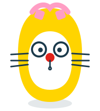
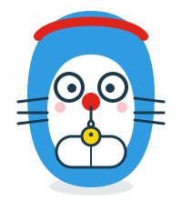

<!-- _class: title -->

AI勉強会 第4回

# 良いRepositoryを作るための掟を学ぶ／Second Brainについて学ぶ

情報を重複させず、正本を1つに保つ。 その考え方を、リポジトリにも自分の知識管理にも当てはめる。

---

## 今回のゴール

- 情報が複製されると何が困るのか説明できる
- 「正本」という考え方を自分の言葉で説明できる
- CODE（捕まえる→整理する→蒸留する→表現する）とPARAの考え方が分かる
- 良いSecond Brainの条件を、自分の言葉でいくつか挙げられる

---

## 目次

1. 同じ情報を複数箇所に書かない
2. 情報の正本を決める
3. AGENTS.mdは短く保つ
4. 詳細ルールは別ファイルに置く
5. Second Brainとは何か
6. CODEで考える
7. PARAで整理する
8. AI時代のSecond Brain
9. 良いSecond Brainの条件

---

<!-- _class: divider -->

01

# 同じ情報を複数箇所に書かない

---

## 複製がもたらす問題

- 同じ決まりを5箇所に書くと、**直すときも5箇所**
- 1箇所だけ更新を忘れると、**どれが正しいか分からなくなる**
- 言い換えて書いても、複製は複製。表現を変えても事故る余地は同じ

  
  

    ガキ大将の注意報
    「一言だけ添えて他のファイルにも書いておこう」が一番危ない。その一言が正本とズレていく。
  

---

<!-- _class: divider -->

02

# 情報の正本を決める

---

## 正本と案内

- **正本**：決まりの本体（判断基準・手順・禁止事項）を置く、たった1つの場所
- **案内**：正本へのリンクと、それが何かを示す1行
- 判断基準そのものを書いたら、それはもう案内ではなく本体

## 見分け方

- 「詳細はこちら」で止まっていれば案内
- 条件や理由まで書き足していたら、それは正本になりつつある

  
  

    ポイント
    正本を移したら、指す側はリンクだけにする。条件・要約・言い換えは添えない。
  

---

<!-- _class: divider -->

03

# AGENTS.mdは短く保つ

---

## なぜ短くするのか

- `AGENTS.md` は**AIが読む人格の定義**が置かれる場所
- 人間向けの説明（README）と、AIへの指示を混ぜない
- 長くなるほど、AIが読む量が呼び出しごとに増えてブレやすくなる

---

<!-- _class: divider -->

04

# 詳細ルールは別ファイルに置く

---

## 必要なときに読む導線を作る

- 常に全部読ませる必要はない
- 「このルールが必要になったらここを見る」という**リンクの導線**を用意する
- 案内役のファイルと、本体を持つファイルを分けておく

  
  

    ひみつ道具メモ
    どこでもドアは、行き先の地図（案内）があるから使える。地図と目的地（正本）を一緒くたにしない。
  

---

<!-- _class: divider -->

05

# Second Brainとは何か

---

## 実は「AI時代の新語」ではない

Second Brainは、生成AIのために生まれた概念ではない。**もともとは人間のための個人知識管理の考え方**として発展してきた。

| 時期 | 出来事 |
|---|---|
| 1945年 | Memex構想（関連する情報をたどる外部記憶） |
| 1998年 | Extended Mind（道具も思考の一部になりうるという理論） |
| 2000〜2010年代 | Evernote・Notion・ObsidianなどでPKMが普及 |
| 2010年代後半 | Tiago ForteがCODE・PARAとして体系化 |
| 2022年11月〜 | ChatGPT公開後、**AIも読む外部記憶**として再評価 |

---

## 昔からあった考え方が、AIで再評価された

- 生成AIの流行で生まれたのではなく、**昔からあった「外部脳」という考え方**が、AIの普及で再評価された
- 変わったのは、読み手が人間だけでなく**AIも加わった**こと。本質（保存より再利用）は変わらない

  
  

    ひみつ道具メモ
    詳しい時系列と背景は <code>docs/references/second-brain-history.md</code> にまとめてある。
  

---

## 何のために作るのか

Second Brainが解決したいのは、情報不足ではなく**情報が再利用できないこと**。

- 読んだ記事や本の内容をすぐ忘れる
- 過去に考えたことを探せない
- 同じ調査や説明を何度も繰り返す
- プロジェクトごとの背景情報が散らばる
- AIに相談しても、前提や文脈を毎回渡す必要がある

  
  

    ひみつ道具メモ
    暗記パンで覚えたことも、書き出しておかないと結局忘れる。Second BrainはAI用の暗記パンの保管庫。
  

---

## 保存されたものから、使える素材へ

Second Brainを作ると、情報は「保存されたもの」から「使える素材」に変わる。

- 単なるメモ置き場ではない
- 大事なのは、**必要なときに見つけて、考えを進め、成果物に変えられる**こと
- 一言でいうと：自分の知識を、**未来の自分やAIが使える形**で残す仕組み

---

<!-- _class: divider -->

06

# CODEで考える

---

## Capture → Organize → Distill → Express

| 段階 | 意味 | 実際にやること |
|---|---|---|
| Capture | 捕まえる | 気になった情報、学び、判断材料を残す |
| Organize | 整理する | あとで使う目的に合わせて置く |
| Distill | 蒸留する | 長い情報から、使える要点だけを抜き出す |
| Express | 表現する | 文章・判断・設計・実装に変換する |

  
  

    ポイント
    最初から完璧に整理しようとしない。まず捕まえ、使う場面に近づけながら磨く。
  

---

<!-- _class: divider -->

07

# PARAで整理する

---

## projects / areas / resources / archives

| 分類 | 役割 | 例 |
|---|---|---|
| Projects | 期限や完了条件がある仕事 | 資料を作る、機能を実装する |
| Areas | 継続して担当する仕事 | 学習、チーム運営 |
| Resources | 再利用する知識 | 活用ノウハウ、参考資料 |
| Archives | 完了・停止・古い情報 | 終わったプロジェクト |

- 何についての情報かではなく、**何に使う情報か**で置き場所を決める
- 迷ったら、まず`inbox`（一時置き場）に置いてよい

---

<!-- _class: divider -->

08

# AI時代のSecond Brain

---

## AIにとっての外部記憶

- 従来のSecond Brainは、**人間が**自分で検索し、読み返し、再利用する仕組みだった
- AI時代は、そこに**AIが加わる**
- AIにとってのSecond Brainは、単なるメモ集ではなく、**AIが文脈を取り戻すための外部記憶**

  
  

    ポイント
    自分 → Second Brain → AI → 提案・整理・下書き → 自分、という循環ができると、毎回ゼロから説明しなくてよくなる。
  

---

## いきなり高度な仕組みは要らない

| 段階 | できること |
|---|---|
| Level 1 | フォルダとルール：どこに何があるか分かる |
| Level 2 | Markdown Wiki：要約・索引・リンクで辿れる |
| Level 3 以上 | 意味検索・知識グラフ・自律更新 |

- 大事なのは、**AIが迷わず読める構造**と、**人間が見ても意味のある要約**
- 最上位レベルが常に正解とは限らない。痛みが出たところだけ足していく

---

<!-- _class: divider -->

09

# 良いSecond Brainの条件

---

## 情報量ではなく、摩擦の小ささ

- 保存する基準があり、置き場所に迷わない
- 1つのメモに1つの主張・要点だけを書く
- 元情報へのリンクが残っている
- 要約だけでなく、**自分の判断や解釈**が残っている
- 古い情報を`archives`へ逃がせる
- AIに読ませても文脈が伝わる

  
  

    ガキ大将の注意報
    集めることが目的になると、誰も読み返さないメモが積み上がる。大事なのは再利用率。
  

---

<!-- _class: closing -->

# 次回は「Git / GitHub」を学びます

第5回：Git / GitHubを学ぶ

