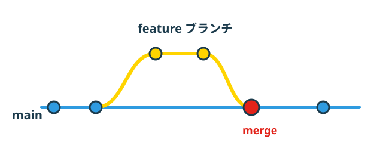

<!-- _class: title -->

<span class="kicker">AI勉強会 第5回</span>

# Git / GitHubを学ぶ

<p class="lead">Gitは手元の作業を記録する道具。<br>GitHubは、その記録をみんなで共有する場所。</p>


---

## 今回のゴール

- GitとGitHubの違いを説明できる
- ローカルとGitHubの関係を理解する
- ブランチとマージの考え方が分かる
- commit / push / pullの基本操作が分かる

---

## 目次

1. GitとGitHubの違い
2. ローカルとGitHubの関係
3. ブランチとマージ
4. commit / push / pullの基本

---

<!-- _class: divider -->

<div class="num">01</div>

# GitとGitHubの違い


---

## Git

- 自分のPCの中で、**ファイルの変更履歴を記録する**ソフト
- いつ・何を変えたかを、あとから追える
- インターネットに繋がっていなくても使える

## GitHub

- Gitの記録を**インターネット上に保管・共有する**サービス
- 他の人と同じRepositoryを見たり、変更を送り合ったりできる
- Gitがなければ動かないが、Git自体はGitHubがなくても使える

<div class="pocket">
  
  <div>
    <span class="label">ポイント</span>
    Git ＝ 自分のメモ帳の下書き。GitHub ＝ その下書きを置く共有の本棚。
  </div>
</div>

---

<!-- _class: divider -->

<div class="num">02</div>

# ローカルとGitHubの関係


---

## 手元とクラウドの2つの場所

- **ローカル**：自分のPCの中にあるRepository
- **リモート（GitHub）**：クラウド上にある同じRepositoryのコピー
- 両者は「送る（push）」「受け取る（pull）」でやり取りする

```text
ローカル（自分のPC） --push--> GitHub
ローカル（自分のPC） <--pull-- GitHub
```

---

<!-- _class: divider -->

<div class="num">03</div>

# ブランチとマージ


---

## ブランチとは

- 履歴の流れを**枝分かれさせて**、本番（`main`）に影響を与えずに作業する仕組み
- 資料の下書きを別コピーで進めるイメージに近い
- 作業が終わったら、`main`に合流させる。これを**マージ**と呼ぶ

<div class="pocket">
  
  <div>
    <span class="label">ポイント</span>
    ブランチを切っておけば、試した作業が気に入らなくても`main`はそのまま無事。
  </div>
</div>

---

## ブランチとマージの流れ（図解）



- `main`から枝分かれして`feature`ブランチで作業する
- 作業が終わったら、`main`に**マージ**して合流する

---

<!-- _class: divider -->

<div class="num">04</div>

# commit / push / pullの基本


---

## 3つの基本操作

| 操作 | することの一言 |
|---|---|
| `commit` | 変更内容を1つの記録として保存する |
| `push` | ローカルの記録をGitHubへ送る |
| `pull` | GitHubの記録をローカルへ取り込む |

<div class="caution">
  
  <div>
    <span class="label">ガキ大将の注意報</span>
    commitしていない変更はpushできない。まず手元で記録してから送る、という順番を忘れないこと。
  </div>
</div>

---

## Second BrainをGitHubにpushする

1. 変更したファイルを確認する（`git status`）
2. 変更を記録する（`git add` → `git commit`）
3. GitHubへ送る（`git push`）

<div class="pocket">
  
  <div>
    <span class="label">ひみつ道具メモ</span>
    パスワードや個人情報が入ったファイルは、そもそもcommitしない。一度送ると、記録には残り続ける。
  </div>
</div>

---

<!-- _class: closing -->

# 次回は「AIにPC作業を任せる」を学びます


<p class="small">第6回（最終回）：AIにPC作業を任せる／自分専用の助手を作る</p>
