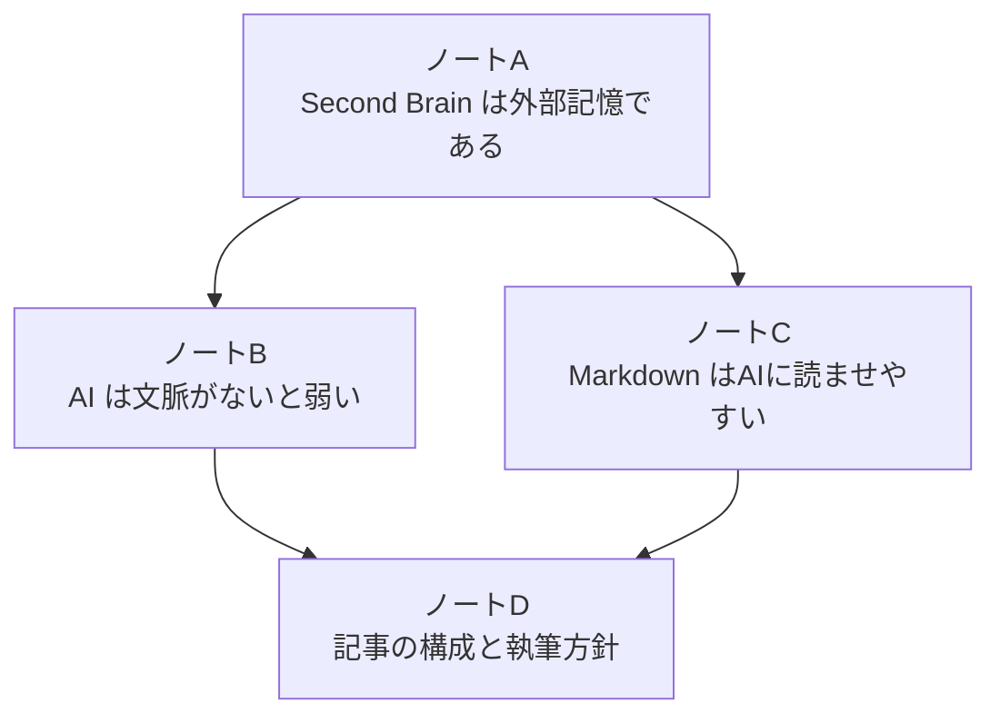
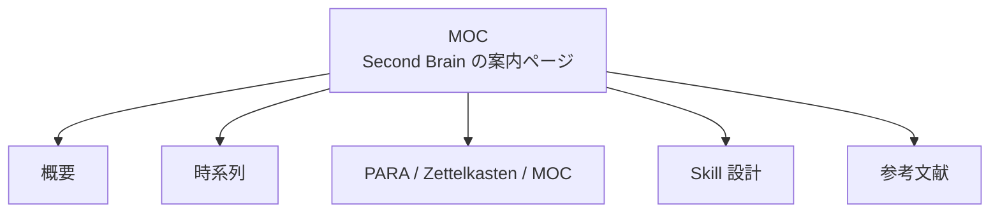

# 整理パターン: PARA, Zettelkasten, MOC

この文書は、Second Brain を整理するときに出てくる `PARA`、`Zettelkasten`、`MOC` の3つを説明し、使い分けを示すための参考資料です。

この3つは同じ種類のものではありません。

| 型 | 主な役割 | 一言でいうと |
| --- | --- | --- |
| PARA | 情報の置き場所を決める | どこに保存するかの整理法 |
| Zettelkasten | ノート同士をつなげて思考を育てる | 小さな知識をリンクで育てる方法 |
| MOC | 関連ノートへの案内ページを作る | ノート群への目次・地図 |

## PARA

PARA は Tiago Forte が提唱・推奨している整理法で、情報をトピック別ではなく、行動に近い順に置く考え方です。基本プロセス `CODE`（Capture → Organize → Distill → Express）のうち、主に `Organize` を担当します。

分類の定義と使い方は [Second Brain とは何か](../second-brain.md) の「整理の考え方: PARA」にまとめてあります。この文書では、Zettelkasten と MOC との違いだけを扱います。

## Zettelkasten

Zettelkasten は、ドイツ語で「カード箱」や「紙片箱」の意味です。

特に有名なのは、社会学者 Niklas Luhmann が使っていた知識管理方法です。小さなメモをたくさん作り、それぞれに識別子を付け、関連するメモ同士をつなげていくことで、思考を発展させます。

Second Brain の文脈で大事なのは、Zettelkasten は「フォルダ整理」ではなく「ノート同士の接続」を重視することです。



この方法は、次のようなケースに向いています。

- 1つの考えを小さなノートに分けたい
- アイデア同士の関係を育てたい
- 読書メモや調査メモを、後日の文章や設計に使いたい
- 思考のネットワークを作りたい

たとえば、`Second Brain はAIのために生まれた概念ではない` というノートと、`AIに文脈を渡すための外部記憶として再評価されている` というノートをリンクできます。

## MOC

MOC は `Map of Content` の略です。

直訳すると「内容の地図」です。実際には、関連するノートへのリンクを集めた案内ページ、目次ページ、ハブページのようなものです。

たとえば `map-of-content.md` は、次のような役割を持ちます。

```markdown
# Second Brain Map of Content

## 基本
- [Second Brain とは何か](../second-brain.md)
- [Second Brain の時系列と進化](second-brain-history.md)

## 整理法
- [整理パターン: PARA, Zettelkasten, MOC](organization-patterns.md)

## 運用ルール
- Inbox を整理する手順
- 入力資料の分類ルール
- Markdown 出力フォーマット
```

MOC は、全部の情報を1つの巨大な説明文にまとめるのではなく、「どのノートを読めばよいか」を案内するために使います。



## どう組み合わせるか

このテンプレートでは、3つを次のように使い分けると分かりやすいです。

| 用途 | 使う型 | 理由 |
| --- | --- | --- |
| ファイルや資料の置き場所を決める | PARA | Project、Area、Resource、Archive で迷いにくい |
| 小さな知識や考えをつなげる | Zettelkasten | ノート同士の関係を育てられる |
| 全体像を案内する | MOC | どこから読めばよいか分かる |

重要なのは、全部を厳密に導入しようとしないことです。

最初は PARA で置き場所を決め、必要に応じて関連ノート同士をリンクし、ノートが増えたら MOC を作る、という順番で十分です。

## README.md で MOC の代わりにできるか

できます。特にこのテンプレートでは、`README.md` を MOC 兼ディレクトリ案内として使うのが自然です。

厳密にいうと、`README.md` は「この場所の説明書」で、MOC は「関連ノートへの地図」です。ただし、Markdown ベースの Second Brain では、`README.md` に次の情報を書けば MOC と同じ役割をかなり果たせます。

- まず読むべきファイル
- ディレクトリごとの役割
- 主要な参考資料へのリンク
- 作業中プロジェクトへのリンク
- AI エージェントが参照すべきルール

人間向けには `README.md`、AI エージェント向けには `AGENTS.md` を置くと、役割が分かりやすくなります。

```text
README.md  = 人間向けの入口・目次・ディレクトリ説明
AGENTS.md  = AI エージェント向けのルーティングルール
本文リンク = Zettelkasten 的な意味の接続
```

## 動画での説明との対応

参考にした動画では、`PARA`、`Zettelkasten`、`MOC` という単語自体は出てきません。

ただし、内容としてはかなり近い話をしています。

| この文書の整理 | 動画で近い説明 |
| --- | --- |
| PARA | フォルダやファイルを、後で人間と AI が探せるように配置する |
| MOC / README | Wiki、indexes、`claude.md` / `agents.md` による「どこに何があるか」の案内 |
| Zettelkasten 的リンク | Wiki 内のリンク、backlinks、see also 的な接続 |
| 意味検索 | exact word search ではなく semantic search で探す |
| 知識グラフ | 単なるリンクではなく、人物・会社・概念などの関係性を明示する |

動画で特に重要なのは、`claude.md` や `agents.md` を「ルーター」として使う考え方です。つまり、AI に対して「個人情報はこのフォルダ」「プロジェクト情報はこのフォルダ」「意思決定ログはこのファイル」のように、情報の探し方を明示します。

また、動画では「これが唯一の正解」という標準構成はまだないとも説明されています。重要なのは、構成が自分にとって分かりやすく、AI にとっても探しやすいことです。

動画で示されている Level 1〜5 の段階は、[Second Brain とは何か](../second-brain.md) の「AI Second Brain の段階」にまとめてあります。

## 参考文献

- [Building a Second Brain: The Definitive Introductory Guide - Forte Labs](https://fortelabs.com/blog/basboverview/)
- [The PARA Method - Forte Labs](https://fortelabs.com/blog/para/)
- [Introduction to the Zettelkasten Method - zettelkasten.de](https://zettelkasten.de/introduction/)
- [Niklas Luhmann-Archiv: Der Zettelkasten Niklas Luhmanns](https://niklas-luhmann-archiv.de/nachlass/zettelkasten)
- [MOCs Overview - Linking Your Thinking](https://notes.linkingyourthinking.com/Cards/MOCs%2BOverview)
- [LYT Kit Lesson 3: Why use Maps of Content - Linking Your Thinking](https://www.linkingyourthinking.com/lyt-kit-lessons/lesson-3)
