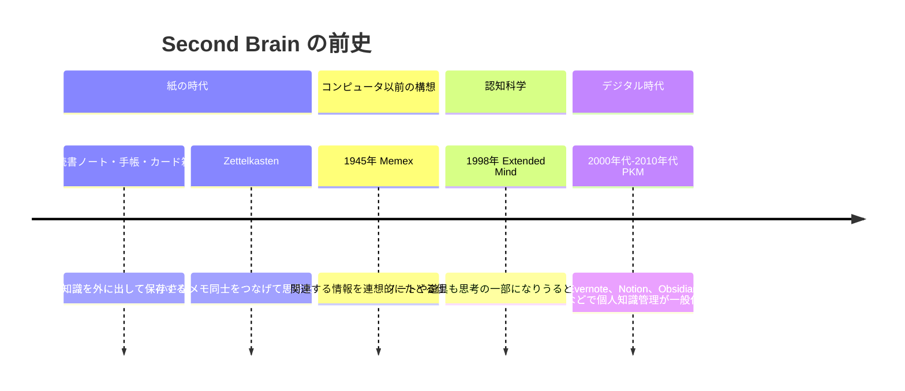
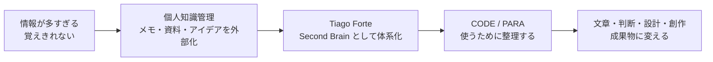
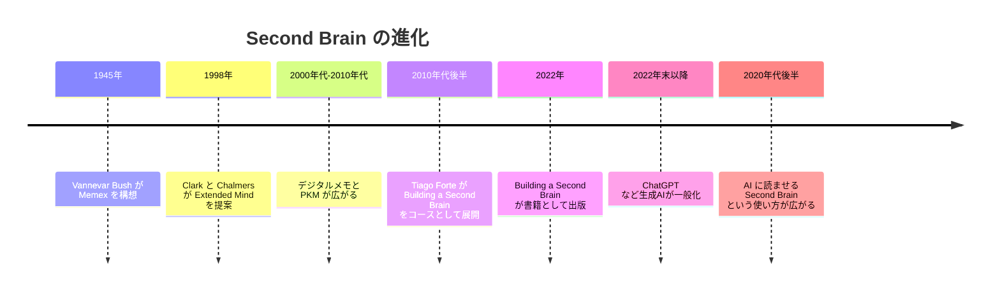
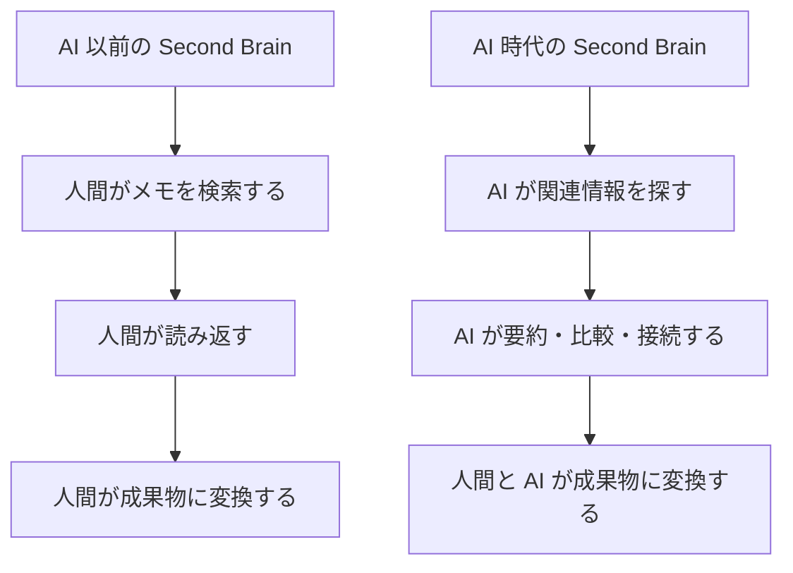

# Second Brain の時系列と進化

この文書は、Second Brain が「AI に情報を共有するために生まれた概念なのか」という疑問に答えるための参考資料です。

結論から言うと、Second Brain は AI のために生まれた概念ではありません。もともとは、情報過多の時代に人間が自分の知識、メモ、資料、アイデアを外部に保存し、あとから再利用するための個人知識管理の考え方です。

AI が広まったことで、Second Brain は「人間が読むための外部記憶」から「人間と AI が共有できる文脈の置き場」へ進化しています。

## 一言でいうと

```text
AI 以前:
  自分のための外部脳

AI 以後:
  自分と AI が同じ文脈を取り戻すための外部脳
```

Second Brain の本質は、情報をただ保存することではなく、あとで使える形に変換することです。

## なぜ生まれたのか

Second Brain が必要になった背景には、次のような問題があります。

- 読んだ本、記事、動画、会議内容を忘れてしまう
- 過去に考えたことを探せない
- プロジェクトごとの判断理由や前提が散らばる
- 情報は増えるのに、成果物に変換できない
- 記憶に頼るほど、創造や判断に使える余力が減る

つまり、Second Brain は「もっと情報を集めるため」ではなく、「集めた情報を使える知識にするため」に生まれた考え方です。

## 前史: 外部記憶という考え方

Second Brain という言葉が広まる前から、人間は外部の道具を使って思考を拡張してきました。



ここで重要なのは、Second Brain は突然生まれた流行語ではなく、「人間の思考は外部の道具で拡張できる」という長い流れの上にあるということです。

## Tiago Forte による体系化

現代的な意味で Second Brain を広めた人物が Tiago Forte です。

Tiago Forte は、Second Brain を個人知識管理の実践法として体系化し、`CODE` と `PARA` という分かりやすいフレームにまとめました。



### CODE

`CODE` は、Second Brain を運用する基本プロセスです。

| 段階 | 意味 | 役割 |
| --- | --- | --- |
| Capture | 捕まえる | 気づき、資料、アイデアを保存する |
| Organize | 整理する | あとで使う目的に合わせて置く |
| Distill | 蒸留する | 要点だけを取り出して濃くする |
| Express | 表現する | 成果物、判断、設計、発信に変える |

### PARA

`PARA` は、情報の置き場所を決める整理法です。`CODE` の中では、主に `Organize`、つまり「捕まえた情報をどこに置くか」を実行するための型として捉えると分かりやすいです。

| 分類 | 意味 | 例 |
| --- | --- | --- |
| Projects | 期限や成果物がある作業 | 記事を執筆して公開する |
| Areas | 継続的に維持する領域 | 学習、健康、仕事、チーム運営 |
| Resources | 将来使う参考資料 | AI、メモ術、設計パターン |
| Archives | 今は使わない保管場所 | 完了したプロジェクト、古い資料 |

## 時系列

Second Brain の流れを大まかに整理すると、次のようになります。



| 時期 | 出来事 | 意味 |
| --- | --- | --- |
| 1945年 | Vannevar Bush が Memex を構想 | 情報を連想的につなぎ、思考を補助する外部記憶の構想 |
| 1998年 | Clark と Chalmers が Extended Mind を提案 | ノートや道具が人間の認知の一部になりうるという理論的背景 |
| 2000年代-2010年代 | デジタルメモ、クラウド、PKM ツールが普及 | 個人が大量の情報を保存・検索できるようになる |
| 2010年代後半 | Tiago Forte が Building a Second Brain をオンラインコースとして展開 | Second Brain が実践メソッドとして広がる |
| 2022年 | 書籍 Building a Second Brain が出版 | 一般向けに Second Brain が体系的に知られる |
| 2022年11月30日 | OpenAI が ChatGPT を公開 | 生成AIに文脈を渡して作業させる使い方が一般化するきっかけになる |
| 2020年代後半 | AI Second Brain という発想が広がる | 人間だけでなく AI も参照する外部記憶として再解釈される |

## 元々の意味

元々の Second Brain は、AI に読ませるためのデータベースではありません。

本来の意味は、次のようなものです。

> 自分の代わりに覚えておき、必要なときに取り出し、考えることや作ることに使える外部の知識システム。

この考え方では、保存よりも再利用が重要です。

たとえば、読書メモを残すだけなら単なる保管です。しかし、そのメモをプロジェクトの判断材料、記事の下書き、設計の前提、次の学習計画に使えるなら Second Brain として機能しています。

## AI 時代に何が変わったのか

AI が広まったことで、Second Brain の価値は大きく変わりました。

以前は、人間が自分で Second Brain を読み、検索し、再利用していました。今は、AI に Second Brain を読ませて、要約、整理、関連付け、下書き、設計、実装支援をさせることができます。



この変化によって、Second Brain は次のような意味を持つようになりました。

- AI に自分の文脈を渡す場所
- プロジェクトの前提、制約、判断理由を保存する場所
- AI が参照できる Markdown ベースの知識ベース
- 作業を継続するための外部メモリ
- 人間と AI の共同作業ログ

ただし、AI 時代になっても本質は変わりません。重要なのは、情報を「保存する」ことではなく「使える形にする」ことです。

## このテンプレートへの示唆

このテンプレートは、人間と AI の両方が情報を見つけ、理解し、再利用できる Second Brain を小さく始めるための土台です。

目指すのは、単にファイルをきれいに並べることではありません。

- 入力された情報を、あとで使える知識に変換する
- Project、Area、Resource、Archive に分類する
- 長い文字起こしや資料から要点を抽出する
- 関連する既存ノートへ接続する
- 人間にも AI にも読める Markdown にする
- 次の行動、判断、成果物につながる形で残す

手作業、AI、専用の Skill のどれを使う場合でも、「知識を次の行動や成果物に変換する」という目的に合わせて運用します。

## 参考文献

- [Vannevar Bush, As We May Think - The Atlantic](https://www.theatlantic.com/magazine/archive/1945/07/as-we-may-think/303881/)
- [Andy Clark and David Chalmers, The Extended Mind](https://consc.net/papers/extended.html)
- [Niklas Luhmann-Archiv: Niklas Luhmann's Card Index](https://niklas-luhmann-archiv.de/bestand/zettelkasten/inhaltsuebersicht)
- [Building a Second Brain: The Definitive Introductory Guide - Forte Labs](https://fortelabs.com/blog/basboverview/)
- [The PARA Method - Forte Labs](https://fortelabs.com/blog/para/)
- [Tiago Forte, I Got a Book Deal. Here's What Happened - Forte Labs](https://fortelabs.com/blog/i-got-a-book-deal-heres-what-happened/)
- [Tiago Forte, New Book: Extend Your Mind - Forte Labs](https://fortelabs.com/blog/new-book-extend-your-mind/)
- [Building a Second Brain - Simon & Schuster](https://www.simonandschuster.com/books/Building-a-Second-Brain/Tiago-Forte/9781982167387)
- [Introducing ChatGPT - OpenAI](https://openai.com/index/chatgpt/)
- [Introducing The AI Second Brain - Forte Labs](https://fortelabs.com/blog/introducing-the-ai-second-brain/)
