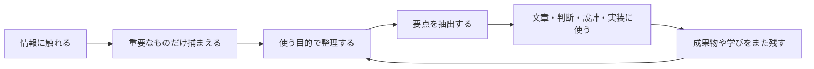
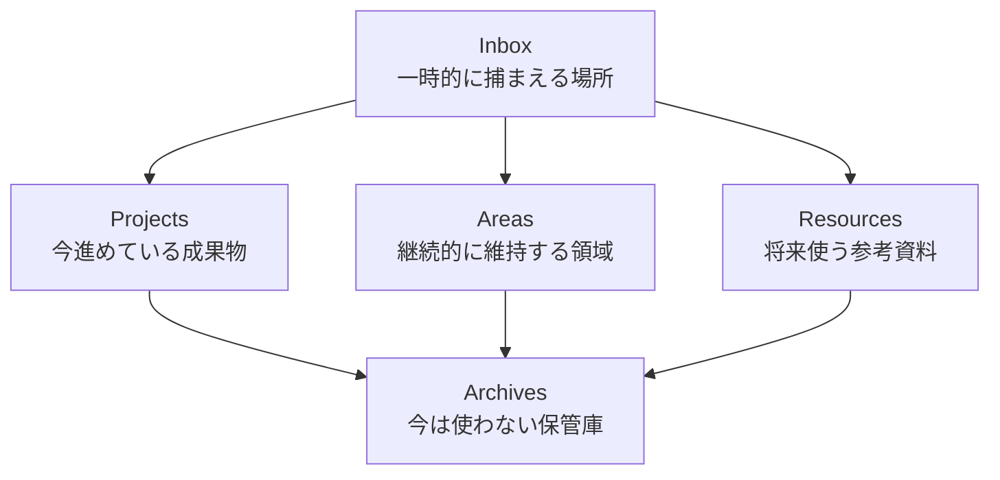
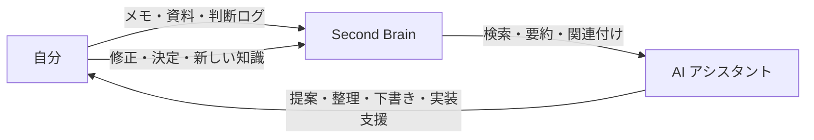
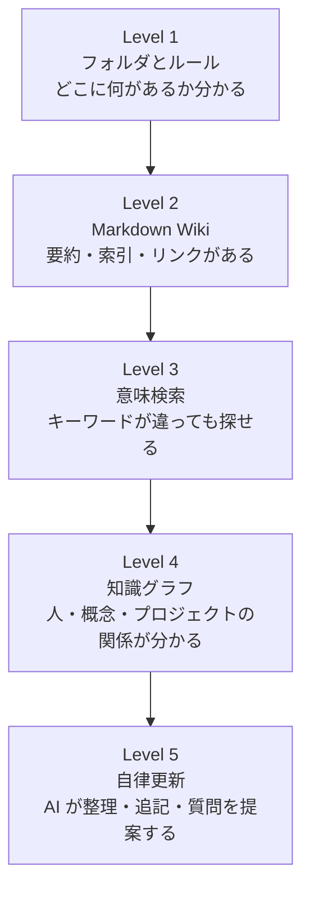
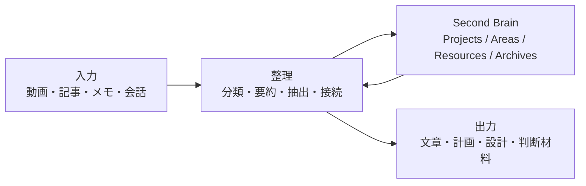

# Second Brain とは何か

Second Brain は、頭の中だけで覚えようとする代わりに、メモ、資料、学び、判断、アイデア、作業ログを外部に保存し、あとから再利用できるようにする知的生産の仕組みです。

単なる「メモ置き場」ではありません。重要なのは、情報を集めることではなく、必要なときに見つけて、考えを進め、成果物に変えられる状態にしておくことです。

一言でいうと、Second Brain は **自分の知識を、未来の自分や AI が使える形で残すシステム** です。

Second Brain は、AI に情報を共有するために生まれた概念ではありません。もともとは人間が自分の知識を外部化し、あとで考える・作る・判断するための個人知識管理の方法として発展しました。生成AIの普及後に、AI が参照できる外部記憶として再評価されています。詳しい時系列と背景は [Second Brain の時系列と進化](references/second-brain-history.md) にまとめています。

## 何のために作るのか

Second Brain が解決したい問題は、情報不足ではなく、情報が再利用できないことです。

- 読んだ記事や本の内容をすぐ忘れる
- 過去に考えたことを探せない
- 同じ調査や説明を何度も繰り返す
- プロジェクトごとの背景情報が散らばる
- AI に相談しても、前提や文脈を毎回渡す必要がある

Second Brain を作ると、情報は「保存されたもの」から「使える素材」に変わります。



## 基本の考え方: CODE

Tiago Forte の Building a Second Brain では、Second Brain の基本プロセスとして `CODE` がよく使われます。

| 段階 | 意味 | 実際にやること |
| --- | --- | --- |
| Capture | 捕まえる | 気になった情報、学び、アイデア、引用、判断材料を残す |
| Organize | 整理する | トピック別ではなく、あとで使う目的に合わせて置く |
| Distill | 蒸留する | 長い情報から、本当に使える要点だけを抜き出す |
| Express | 表現する | 記事、資料、意思決定、コード、設計、会話に変換する |

ポイントは、最初から完璧に整理しようとしないことです。まず捕まえ、あとで使う場面に近づけながら磨きます。

## 整理の考え方: PARA

Second Brain では、情報を「何についての情報か」ではなく「何に使う情報か」で整理します。その代表的な方法が `PARA` です。

補足すると、PARA は `CODE` 全体の代替ではありません。`CODE` の中では、特に `Organize`、つまり「捕まえた情報をどこに置くか」を決めるための整理法です。PARA と他の整理パターンについては [整理パターン: PARA, Zettelkasten, MOC](references/organization-patterns.md) にまとめています。

| 分類 | 役割 | 例 |
| --- | --- | --- |
| Projects | 期限や成果物がある作業 | 記事を書く、アプリを実装する、旅行を計画する |
| Areas | 継続的に維持する責任領域 | 健康、仕事、学習、チーム運営、個人ナレッジ管理 |
| Resources | 将来使うかもしれない参考資料 | AI 活用、メモ術、設計パターン、プロンプト集 |
| Archives | 今は使わない保管場所 | 完了したプロジェクト、古い資料、終了したテーマ |



この整理法の強みは、今の行動に近いものほど見つけやすくなることです。たとえば「文章」という巨大なフォルダに全部入れるより、「記事を執筆して公開する」という Project に必要な情報を集めた方が、すぐに使えます。

## AI 時代の Second Brain

従来の Second Brain は、人間が自分で検索し、読み返し、再利用する仕組みでした。AI 時代の Second Brain では、そこに AI が加わります。

AI にとっての Second Brain は、単なるメモ集ではなく、**AI が文脈を取り戻すための外部記憶** です。



AI Second Brain では、次のようなことが重要になります。

- AI が読むべき場所を迷わないフォルダ構成
- プロジェクトの前提、制約、判断理由が残っていること
- 長い資料が要約され、再利用しやすい単位に分かれていること
- どの情報が最新で、どの情報が古いかが分かること
- 人間だけでなく AI も参照できるインデックスがあること

## AI Second Brain の段階

リンクされた動画は Claude と Second Brain を組み合わせる文脈の動画で、考え方としては「ただファイルを置く」段階から、「AI が意味や関係性を理解して使う」段階へ進んでいくものと捉えると分かりやすいです。

動画では、AI Second Brain は「Markdown ファイルとフォルダを、人間と AI エージェントの両方が理解できる形で整理したもの」と説明されています。特に重要なのは、`claude.md` や `agents.md` をルーターとして使い、「どの情報はどこにあるか」「どの順番で見に行くか」を AI に教えることです。



| レベル | できること | 注意点 |
| --- | --- | --- |
| Level 1: フォルダとルール | AI と人間が参照しやすい場所を決める | まずここを雑にしない |
| Level 2: Markdown Wiki | 要約、索引、リンクで知識を辿れる | 書きっぱなしにしない |
| Level 3: 意味検索 | ベクトル検索などで意味から探せる | 量が少ないうちは過剰設計になりやすい |
| Level 4: 知識グラフ | 概念やプロジェクトの関係を扱える | メンテナンス方法が必要 |
| Level 5: 自律更新 | AI が整理や追記を補助する | 誤更新、情報漏えい、古い情報の混入に注意 |

大事なのは、いきなり高度な仕組みを作ることではありません。最初に必要なのは、AI が迷わず読める構造と、人間が見ても意味のある要約です。

動画でも、最上位レベルが常に最善とは言っていません。まずは、自分と AI がファイルを見つけられる最低限のルーティングから始め、痛みが出たところだけ Wiki、意味検索、知識グラフを足す考え方です。

## 良い Second Brain の条件

良い Second Brain は、情報量が多いものではなく、使うときの摩擦が小さいものです。

- 保存する基準がある
- 置き場所に迷わない
- 1つのメモに1つの主張や要点がある
- 元情報へのリンクが残っている
- 要約だけでなく、自分の判断や解釈が残っている
- プロジェクトに近い場所から探せる
- 古い情報を Archive に逃がせる
- AI に読ませても文脈が伝わる

逆に、失敗しやすい Second Brain は、情報を集めること自体が目的になっています。収集量よりも、再利用率を上げることが重要です。

## このテンプレートで目指すもの

このテンプレートは、情報を保存するだけでなく、入力を整理し、必要なときに再利用できる Second Brain を小さく始めるための土台です。



この流れは手作業でも運用できます。AI や同梱された Skill を使う場合は、次の処理を支援させると便利です。

- 入力された資料から、あとで使える要点を抽出する
- Project、Area、Resource、Archive のどこに置くべきか判断する
- 長い文字起こしを、要約、重要引用、行動アイデアに分ける
- 既存ノートとの関連を見つける
- AI が読むための索引やルーティング情報を更新する
- 「次に何を作るべきか」「どの情報が足りないか」を提案する

## 最小構成の例

最初から大きなシステムにせず、Markdown ベースで始めるなら、次のような構成で十分です。

```text
second-brain/
  inbox/
    raw-notes/
    transcripts/
  projects/
    publish-article/
      overview.md
      decisions.md
      sources.md
  areas/
    health/
    learning/
  resources/
    writing/
    research-methods/
  archives/
  indexes/
    map-of-content.md
    glossary.md
```

`inbox` は一時置き場です。最終的には、今動いている `projects` に寄せるか、将来の参考として `resources` に移します。

`indexes/map-of-content.md` は MOC、つまり関連ノートへの案内ページとして使います。これは PARA とは別の考え方で、ノートが増えたときに「どこから読めばよいか」を示すための目次や地図の役割を持ちます。

## まとめ

Second Brain は、情報を保存する場所ではなく、思考と成果物をつなぐ仕組みです。

特に AI と組み合わせる場合は、次の一文で考えると分かりやすいです。

> Second Brain とは、自分と AI が同じ文脈を取り戻し、過去の知識を未来の成果物に変えるための外部記憶である。

最初に作るべきなのは、高度な検索システムではありません。まずは、情報を捕まえ、目的別に置き、要点を抽出し、次のアウトプットに使えるようにすることです。

## 参考

- [Building a Second Brain - Forte Labs](https://fortelabs.com/blog/basboverview/)
- [The PARA Method - Forte Labs](https://fortelabs.com/blog/para/)
- [YouTube: Every Level of a Claude Second Brain Explained](https://www.youtube.com/watch?v=DTCyvo6cC54)
